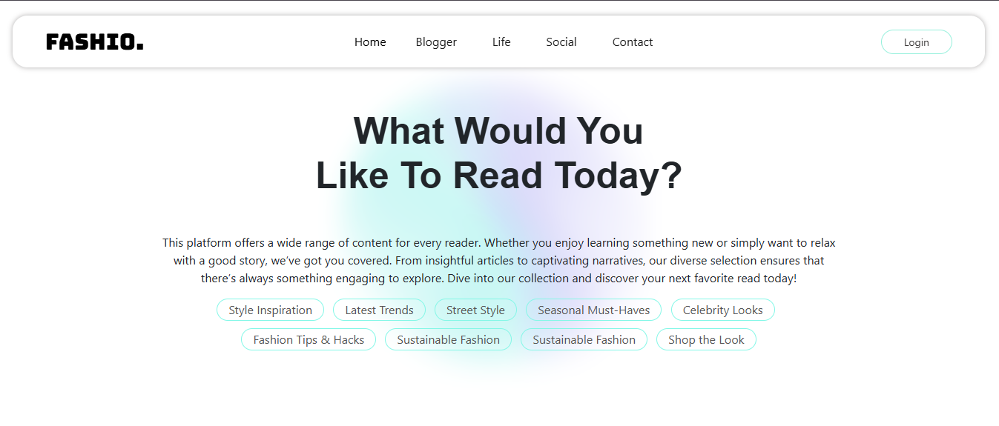
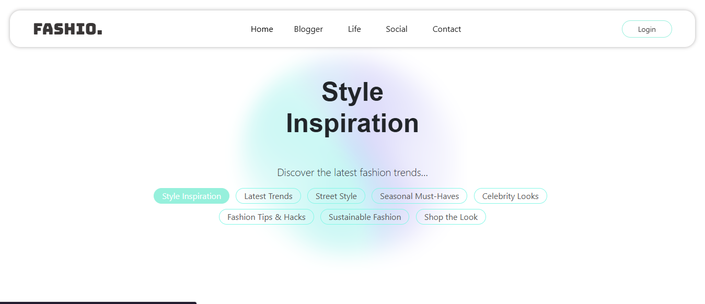
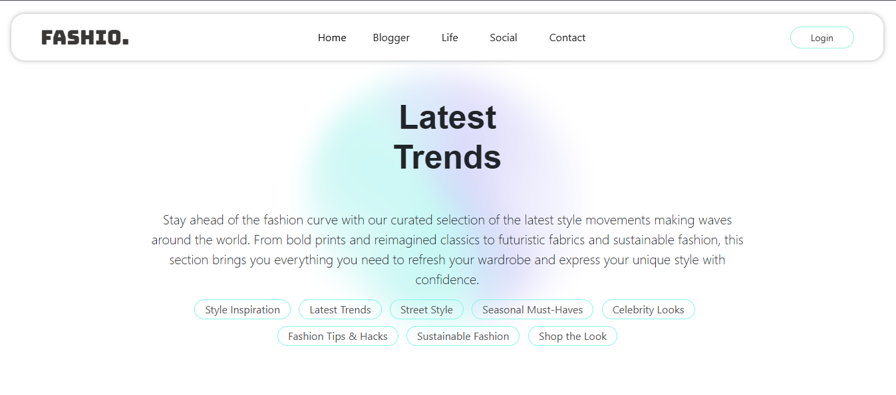
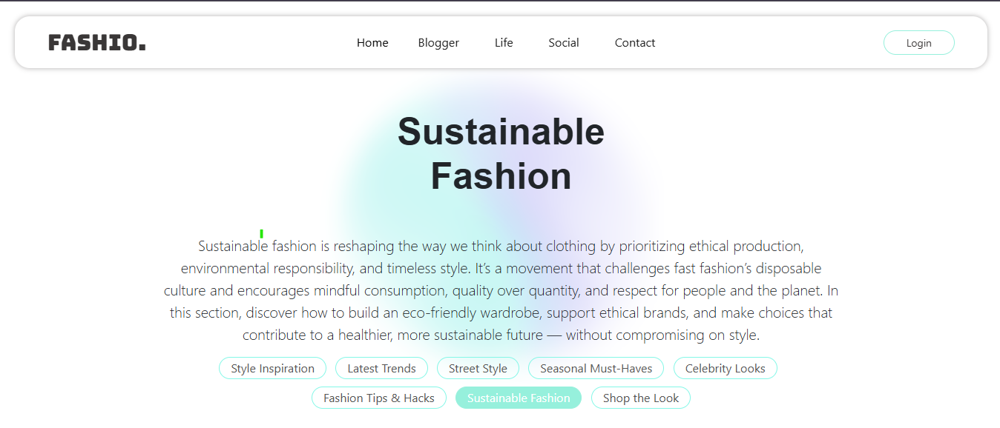
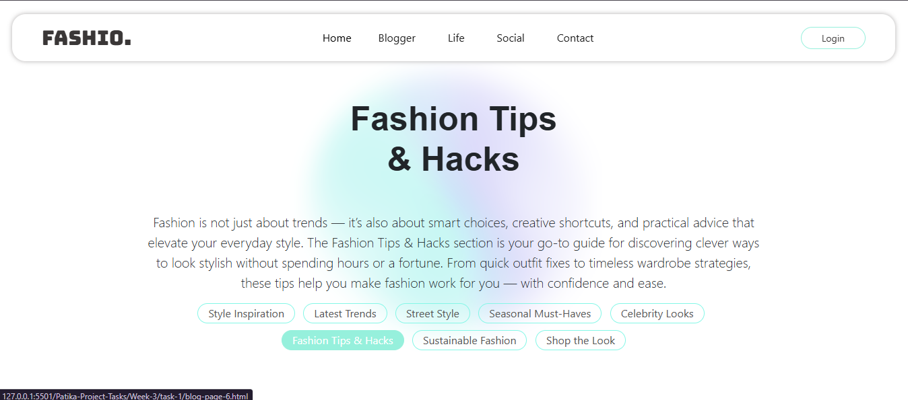
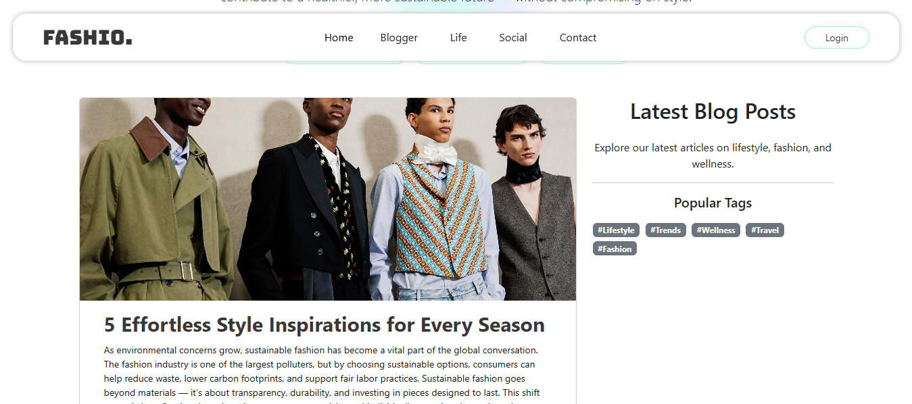

###  Ödev 1 - Blog Sayfası Oluşturma -

HTML Form Created According to the Following Requirements
This project is a fashion-themed, dynamic, and aesthetic Blog Page developed using HTML, CSS, and Bootstrap. Users can explore fashion trends, street style, celebrity looks, and sustainable fashion articles. The page has a modern appearance and is fully responsive across all devices.

*** Implemented Features ***
 
-----------------------------------------------------------------------------

*** 1. Theme and Variable Definitions ***

Colors, fonts, and styles were defined using :root.

The main color used is: hwb(167 59% 6%).

Google Fonts “Bungee” and “Nunito Sans” were included.
---

*** 2. Navbar (Top Menu) ***

A responsive navbar was created using Bootstrap 5.

The navbar includes:

Menu links (Home, Blogger, Life, Social, Contact)

A “Login” button on the right (with hover color effect)

An off-canvas menu for small screens

Custom styles were added: box-shadow, border-radius, and special padding.
---

*** 3. Hero Section ***

A visually appealing hero area with a background image.

Large heading: "Style Inspiration"

Below it, blog filter buttons (Style Inspiration, Latest Trends, Street Style, Seasonal Must Haves, etc.)
---

*** 4. Blog Cards ***

Blog content was listed using Bootstrap card components.

Each card contains:

Title

Descriptive text (blog content)

Featured image

Last updated date

Images were styled with object-fit: cover to keep aspect ratios.

Custom classes were applied: card-title, card-text, card-img.
---

*** 5. Sidebar ***

A sidebar section was created on the right side of the page.

Contents include:

A brief text titled “Latest Blog Posts”

“Popular Tags” section with badge-style links (#Lifestyle, #Trends, #Wellness, etc.)
---

*** 6. Custom CSS Enhancements ***

Custom classes created for navbar, buttons, blog cards, and sidebar elements:

.login-button, .custom-btn, .custom-img, .custom-h1-class, etc.

Added hover effects, transition animations, and interactive elements.

Modern styles like box-shadow, border, and border-radius were used for responsiveness and design.
---

*** 7. Responsive Design ***

Entire layout was developed with the Bootstrap grid system for mobile, tablet, and desktop compatibility.

Navbar and blog cards adapt in layout for smaller screens.
---

*** Technologies ***
1. HTML5

2. CSS3

3. Bootstrap 5.3.7

4. Google Fonts (Bungee, Nunito Sans)
